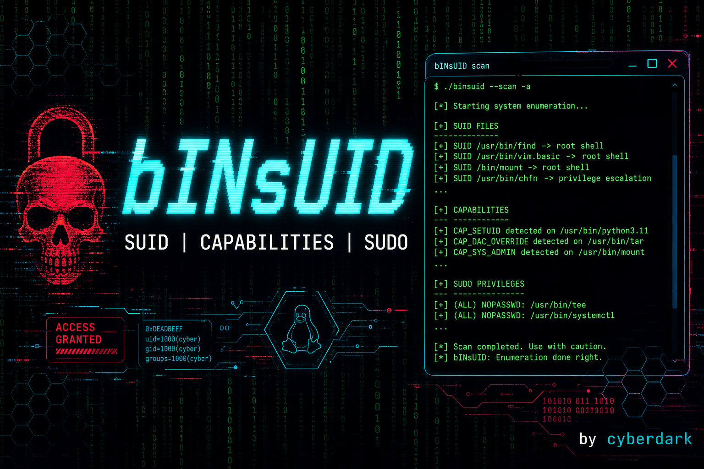

<p align="center">
  
</p>

# bINsUID

Automatic Linux privilege escalation for authorized labs and training.
Scan SUID, capabilities, and sudo — then escalate with one command.

> Authorized testing and training only.

## Start here (any lab)

**One command.** Works without git or pip. Needs Linux + bash + (`curl` or `wget` on the install host). **Python 3 optional** — without it, `binsuid` runs a focused bash scanner (like linpeas, but only privesc vectors).

```bash
curl -fsSL https://raw.githubusercontent.com/Cyberdark-Security/bINsUID/main/scripts/get-binsuid.sh | bash
source ~/.bashrc
binsuid --scan-only
```

**No Python on the target?** Copy or curl the bash scanner only:

```bash
# From Kali host into a minimal container:
docker cp scripts/binsuid-scan.sh breach:/tmp/binsuid-scan.sh
docker exec breach bash /tmp/binsuid-scan.sh --quick

# Or one file from GitHub (needs curl/wget once):
curl -fsSL https://raw.githubusercontent.com/Cyberdark-Security/bINsUID/main/scripts/binsuid-scan.sh | bash -s -- --quick
```

**Update later** (works from pip, .deb, or any old install):

```bash
binsuid --upgrade
# or: curl -fsSL https://raw.githubusercontent.com/Cyberdark-Security/bINsUID/main/scripts/upgrade-binsuid.sh | bash
```

Spanish guide by environment: **[docs/INSTALL.es.md](docs/INSTALL.es.md)**  
Lab handout for students: **[docs/LEEME-LAB.txt](docs/LEEME-LAB.txt)** (copy into your container's `LEEME.txt`)

## Usage

```bash
binsuid                  # scan, show target, confirm escalation (Y)
binsuid --scan-only      # scan only
binsuid --auto -y        # escalate immediately
binsuid --auto --dry-run -y  # preview command only
```

## What it does

- Finds SUID/SGID binaries, dangerous capabilities, sudo rules (incl. SETENV), writable PATH, cron surfaces, and privileged groups
- **Highlights the lab target** (hides standard system SUID noise)
- Suggests the next command (`binsuid --auto -y`)
- Built-in payloads for 50+ binaries + PATH hijack detection
- Offline GTFOBins data — no internet needed after download

## Scripting

```bash
binsuid --json --scan-only --quick   # exit 1 when auto-exploitable targets exist
binsuid --scan-only --skip-sudo --skip-capabilities --quick
```

## Requirements

| Required | Optional (warnings if missing) |
|----------|--------------------------------|
| Linux + bash + `find` | Python 3 (full scan + auto-escalate) |
| curl or wget (install host) | `getcap` (capabilities scan) |
| | passwordless `sudo -l` (sudo scan) |

**Without Python:** `binsuid` / `binsuid-scan.sh` run bash recon only (SUID, SGID, sudo, caps, PATH, cron, groups).

## Other install methods

| Environment | Method |
|-------------|--------|
| Any minimal lab | [`scripts/get-binsuid.sh`](scripts/get-binsuid.sh) |
| Kali / pipx | `pipx install https://github.com/Cyberdark-Security/bINsUID.git` |
| Debian package | `sudo dpkg -i binsuid_*.deb` from [Releases](https://github.com/Cyberdark-Security/bINsUID/releases) |
| No install, one-shot | `curl -sL …/main.tar.gz \| tar xz -C /tmp && cd /tmp/bINsUID-main && python3 -m binsuid` |

Details: [docs/INSTALL.es.md](docs/INSTALL.es.md) (Spanish) · [scripts/](scripts/)

## Example output

```
  Priority targets    : 1
  System noise hidden : 18

  >>> AUTO SUID /usr/local/bin/backup
         -> Automatic PATH hijack (tar) via SUID

  RECOMMENDED TARGET
  Next step: binsuid --auto -y
```

## Kali Linux packaging

See [packaging/KALI-SUBMISSION.md](packaging/KALI-SUBMISSION.md).

## License

GPL-3.0-or-later — see [LICENSE](LICENSE).
